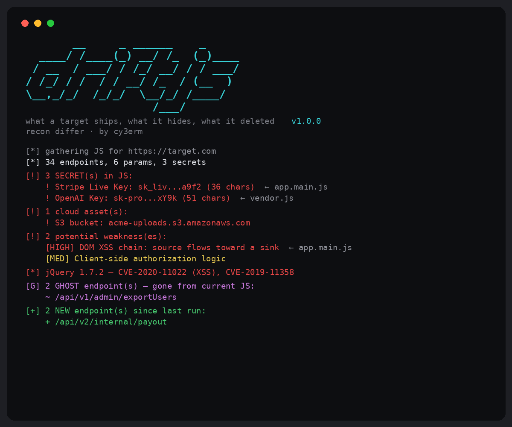

# driftjs



**driftjs watches JavaScript attack surface over time.** It extracts endpoints, secrets, params, cloud assets, source maps, DOM sinks, libraries, internal hosts, websockets, and archived ghost routes, then tells you what changed after each deploy.

The idea came from a simple thing every hunter runs into: JS files are where the real attack surface hides (API routes, hidden params, keys), but re-reading them by hand every time a site ships a new build is miserable. So driftjs snapshots what it finds and diffs it. First run is a baseline. Every run after tells you what changed, which is usually the stuff nobody's tested yet.

```bash
driftjs https://target.com                    # basic scan
driftjs --local app.js                        # scan a local JS file
driftjs https://target.com --json             # machine-readable output (jq/nuclei/ffuf)
driftjs https://target.com --since-last        # only what changed since last run
driftjs https://target.com --maps             # recover original source from source maps
driftjs https://target.com --wayback          # ghost endpoints from archived JS
driftjs https://target.com --probe --scope target.com   # active liveness check (authorized only)
driftjs https://target.com --watch 3600 --webhook https://discord.com/api/webhooks/...
```

**driftjs is passive by default.** It downloads JavaScript that a browser can already access. Active probing is opt-in with `--probe` and should only be used on assets you are authorized to test.


```
$ driftjs https://target.com

[!] 1 SECRET(s) in JS:
    ! Stripe Live Key: sk_liv...abcd (36 chars)

[*] 4 interesting endpoint(s):
    > /api/v1/admin/users?debug&redirect
    > /graphql
    > /internal/config

[*] interesting param(s): debug, redirect
[*] DOM XSS sink(s) present: innerHTML, eval, dangerouslySetInnerHTML
[*] 1 source map(s) referenced (original source may be recoverable):
    ~ app.min.js.map

[+] 2 NEW endpoint(s) since last run:
    + /api/v2/internal/transfer
    + /api/v1/payout
```

## What it pulls out

- **Endpoints and paths** from fetch/axios/XHR calls and string literals, with IDs and hashes normalized so `/users/1` and `/users/2` count as one route (keeps the diff quiet)
- **Secrets** — ~60 patterns: AWS, Google, Firebase, Stripe, OpenAI, Anthropic, Discord, Telegram, Cloudflare, GitHub, GitLab, Slack, Twilio, SendGrid, Notion, Linear, Supabase, and more, plus JWTs and private keys. It also flags high-entropy strings assigned to secret-like names (catching unknown providers) and decodes base64 blobs to find keys hidden inside them.
- **Cloud assets** — S3 buckets, GCS buckets, Azure blobs, DigitalOcean Spaces, Firebase Storage (worth checking for public/misconfigured access)
- **Notable signals** — SSRF/cloud-metadata targets (`169.254.169.254`), hardcoded Bearer/Basic auth, `localStorage` token access, GraphQL introspection, debug flags
- **Weakness indicators** — high-signal insecure patterns worth investigating: DOM XSS source-to-sink chains, `postMessage` handlers with no origin check, client-side authorization logic, prototype-pollution sinks, weak crypto (MD5/SHA1/DES), `alg: none` JWTs, `Math.random()` in security contexts, insecure `http://` URLs. Graded high/medium/low, and framed as leads to verify — not confirmed bugs.
- **Vulnerable libraries** — detects JS library versions (jQuery, lodash, AngularJS, Bootstrap, Handlebars, and more) and flags known-vulnerable versions. With `--cve` it queries the OSV vulnerability database live and lists the real CVEs/advisories affecting each detected version.
- **Developer comments** — surfaces `TODO`, `FIXME`, `HACK`, and notes mentioning passwords, secrets, "hardcoded", "insecure", "internal only", and similar — the kind of thing devs leave in bundles by accident.
- **Internal hosts & private IPs** — flags `*.internal` / `*.corp` / `*.staging` hostnames and RFC-1918 IPs (10.x, 192.168.x, 172.16–31.x) that leak internal infrastructure.
- **WebSocket endpoints** — `ws://` / `wss://` URLs, an attack surface that's easy to miss.
- **Interesting params** — the ones worth fuzzing: `redirect`, `url`, `debug`, `admin`, `token`, `callback`, etc. (open-redirect / SSRF / IDOR signals)
- **Interesting endpoints** — `/admin`, `/internal`, `/graphql`, `/swagger`, `/api-docs`, `/actuator`, api versions, and other high-value paths
- **DOM XSS sinks** — `innerHTML`, `eval`, `document.write`, `dangerouslySetInnerHTML`, and friends
- **Source maps** — flags `sourceMappingURL` refs, and with `--maps` it fetches the `.map` files and recovers the original, un-minified source: real file paths, variable names, comments, and dev-only modules, all re-scanned for endpoints, secrets, and everything else.
- **Ghost endpoints** (`--wayback`) — pulls archived JS from the Wayback Machine and surfaces routes that existed in old builds but are gone from the current one. Devs remove the UI button, not the endpoint.

And it **diffs everything over time** — new endpoints, new secrets, new params since the last run. Every finding is tagged with the JS file it came from (shown inline as `← app.abc123.js`, and as a `sources` map in `--json`), so you can jump straight to the right bundle.

**Watch mode** (`--watch SECONDS`) turns that diff into monitoring: it re-checks on an interval and alerts you the moment something new shows up — in the terminal, and to a Discord or Slack webhook with `--webhook`. **HTML reports** (`--html FILE`) write a clean, shareable dossier of everything found.

## Running it

Python 3.10+ only, no dependencies.

```bash
pipx install git+https://github.com/cy3erm/driftjs
driftjs https://target.com
```

Or clone and run:

```bash
git clone https://github.com/cy3erm/driftjs
cd driftjs
python3 -m driftjs https://target.com
```

Options:

```bash
driftjs https://target.com --wayback          # also surface deleted/archived endpoints
driftjs https://target.com --maps             # recover original source from source maps
driftjs https://target.com --cve              # look up real CVEs for detected libraries (OSV)
driftjs https://target.com --all              # everything passive at once (wayback + maps)
driftjs https://target.com --html report.html # write a shareable HTML report
driftjs https://target.com --watch 3600       # re-check hourly, alert on anything new
driftjs https://target.com --watch 3600 --webhook https://discord.com/api/webhooks/...
driftjs "*.target.com"                        # find + scan JS across all subdomains (crt.sh)
driftjs --list targets.txt                    # scan many targets from a file (one per line)
driftjs https://target.com --json             # JSON output, for piping into other tools
driftjs https://target.com --wordlist out.txt # dump paths+params as a fuzzing wordlist
driftjs https://target.com --probe            # ACTIVE: check which endpoints are live
driftjs https://target.com/app.js             # a single JS bundle
driftjs --local app.js                        # a local file
```

Give it `*.target.com` and it pulls every subdomain that's ever had a TLS certificate from Certificate Transparency logs (crt.sh, no API key), then scans JS across all of them and prints a compact per-host summary plus a rollup of which hosts have secrets or interesting endpoints. `--sub-limit` caps how many it scans (default 50). Quote the argument so your shell doesn't expand the `*`.

`--probe` is the only part that sends requests. It checks which discovered endpoints (and, with `--wayback`, which deleted ghost endpoints) actually respond, so a route that was removed from the UI but still returns 200 gets flagged as high value. It's off by default, opt-in only, rate-limited, uses HEAD/GET (never destructive methods), and it only touches the target's own host plus any host you explicitly add with `--scope`. Anything out of scope is skipped, not probed.

## Where it draws the line

Reading and analysing JavaScript is passive — it's what a browser does on every page load, so gathering it needs no special access. The only active feature is `--probe`, and it's built to stay inside a scope you control: it refuses to send a request to any host that isn't the target or explicitly allow-listed with `--scope`. Only run probing (and only hunt at all) against programs and assets you're authorized to test.

## Adding detections

Secret patterns live in `driftjs/secrets.py`, interesting params/paths and XSS sinks in `driftjs/analyze.py`. Each is a small, obvious entry. There's a test suite (`python -m pytest`) that locks in the extraction and filtering behavior — run it before sending a change.

## License

MIT
